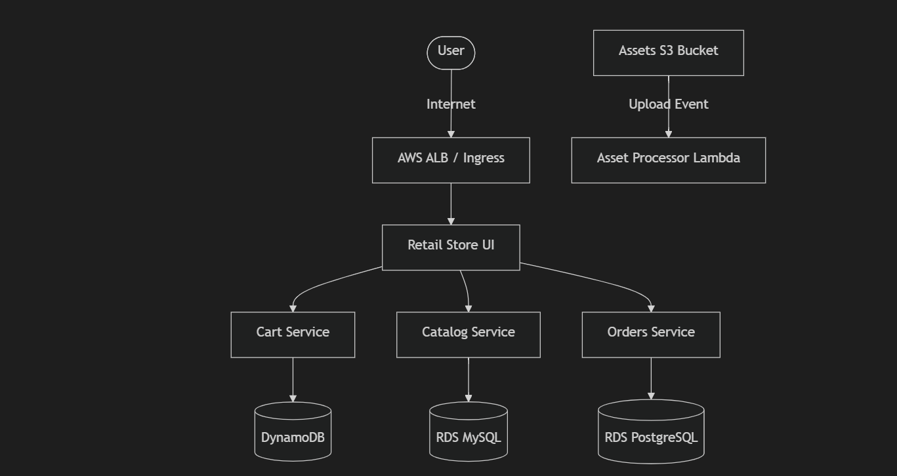

# Project Bedrock: InnovateMart on EKS

## Overview
**Project Bedrock** deploys **InnovateMart**, a polyglot microservices-based e-commerce platform (derived from the AWS Retail Store Sample App), onto a highly available **Amazon Elastic Kubernetes Service (EKS)** cluster. The entire infrastructure and application lifecycle is managed using **Terraform**, **Helm**, and **GitHub Actions**.

## Architecture Highlights

- **Infrastructure as Code (IaC):** Fully automated provisioning of VPC, Subnets, and an EKS Cluster (v1.34) using Terraform.
- **Microservices Architecture:** 10+ independently scalable microservices written in Java, Node.js, and Python.
- **External Managed Databases:** 
  - **Catalog Service:** Connects to an external Amazon RDS MySQL instance.
  - **Orders Service:** Connects to an external Amazon RDS PostgreSQL instance.
- **In-Cluster Datastores:** Utilizes Redis for Checkout and RabbitMQ for Orders messaging.
- **Carts Service:** Connects to a managed Amazon DynamoDB table via IRSA.
- **Ingress:** Exposes the UI via an ALB using the AWS Load Balancer Controller and a Kubernetes Ingress resource.
- **Networking Optimization:** Deploys with AWS VPC CNI Prefix Delegation enabled, allowing dense pod packing on `t3.small` nodes to bypass the typical 11-pod ENI limits.

## Application Components
| Service | Language | Description |
| :--- | :--- | :--- |
| **UI** | Java (Spring Boot) | The frontend web interface for customers to browse the store. |
| **Catalog** | Go / Java | Manages the product catalog. Backed by Amazon RDS MySQL. |
| **Carts** | Java | Manages user shopping carts. Backed by Amazon DynamoDB. |
| **Orders** | Java (Spring Boot) | Processes customer orders. Backed by Amazon RDS PostgreSQL and RabbitMQ. |
| **Checkout** | Node.js | Handles the checkout workflow. Backed by Redis. |
| **Assets** | Python | Serves static assets (images, CSS) for the UI. |

## Accessing the Application
The frontend user interface is exposed securely to the internet via an AWS Load Balancer.
Once the deployment finishes, the store can be accessed at:
[http://a34abdd923a4d40bea8eae7c7c470e7d-317964416.us-east-1.elb.amazonaws.com](http://a34abdd923a4d40bea8eae7c7c470e7d-317964416.us-east-1.elb.amazonaws.com)

## Repository Structure
- `.github/workflows/`: Contains CI/CD pipelines for Terraform execution and cluster debugging.
- `terraform/`: Contains all Infrastructure as Code modules (EKS, VPC, RDS).
- `helm/`: Custom values template for Helm deployments, disabling in-cluster databases in favor of external RDS/DynamoDB.
- `k8s/`: Kubernetes manifests (ALB Ingress resource).
- `lambda/`: Serverless functions (if applicable).
- `grading.json`: Final output parameters for the project submission.

## Deployment Instructions
The entire infrastructure and application stack is deployed automatically upon a push to the `main` branch. 
The GitHub Actions workflow `terraform-ci-cd.yml`:
1. Provisions the AWS resources via Terraform (`terraform apply`).
2. Fetches the dynamically generated RDS endpoints.
3. Injects the endpoints into `helm/custom-values.yaml` using `envsubst`.
4. Triggers a `helm upgrade` to deploy the application payload to the EKS cluster.
5. Forces a rollout restart of the UI deployment to ensure it picks up the latest backend endpoints.
